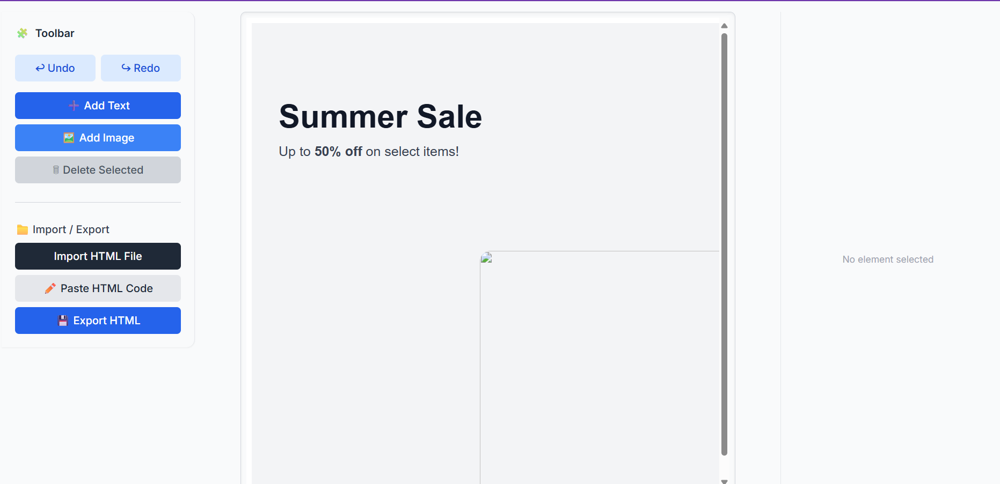

# Live website Link- https://editable-html-poster.onrender.com

# 🧩 Editable HTML Poster Builder

A powerful, interactive web application for designing and editing HTML posters directly in your browser. Built with modern web technologies, this tool provides a seamless visual editing experience with drag-and-drop functionality, real-time preview, and full HTML import/export capabilities.

# Editable HTML Poster 🎨

A web-based drag-and-drop poster editor built with **Next.js**, **TypeScript**, and **Tailwind CSS**.

## 🚀 Features

- **Visual HTML Editing**: Edit HTML posters directly on a live canvas using an embedded iframe
- **Drag & Drop**: Effortlessly reposition text and image elements on your poster
- **Text & Image Support**: Add, edit, and customize text blocks and images inline
- **Undo/Redo Stack**: Full undo and redo functionality to manage your editing history
- **Properties Panel**: Intuitive panel for editing text content and image properties
- **HTML Import/Export**: Import existing HTML files and export your designs as HTML
- **Responsive Toolbar**: Quick access to all editing actions and tools
- **Type-Safe Development**: Built entirely in TypeScript for robust, maintainable code

## ⚙️ Setup Instructions

### Prerequisites

- **Node.js**: Version 18.17 or higher
- **npm** or **yarn**: Package manager for dependency installation

### Installation

1. **Clone the repository:**
   \`\`\`bash
   git clone https://github.com/ghanshyam-du/Editable-Html-Poster
   cd Editable-HTML-Poster
   \`\`\`

2. **Install dependencies:**
   \`\`\`bash
   npm install
   \`\`\`

3. **Start the development server:**
   \`\`\`bash
   npm run dev
   \`\`\`

4. **Open in your browser:**
   - Navigate to `http://localhost:3000`
   - Your app should now be running and ready to use

### Build for Production

\`\`\`bash
npm run build
npm start
\`\`\`

## 🏗️ Architecture Overview

The Editable HTML Poster Builder follows a **modular, component-driven architecture** that emphasizes separation of concerns and maintainability.

### Directory Structure

\`\`\`
Editable-HTML-Poster/
│
├── app/
│   ├── page.tsx              # Main application page (integrates Stage + Toolbar + PropertiesPanel)
│   ├── layout.tsx            # Root layout wrapping providers and context setup
│   ├── globals.css           # Global Tailwind CSS and base styling
│
├── components/
│   ├── Toolbar.tsx           # UI controls for adding elements, undo/redo, and import/export
│   ├── Stage.tsx             # Main iframe canvas where HTML editing happens
│   ├── PropertiesPanel.tsx   # Side panel for editing element text and image properties
│
├── lib/
│   ├── htmlService.tsx       # Utilities for HTML sanitization, injection, and export
│   ├── selectionService.tsx  # Manages selected element context and state
│   ├── historyService.tsx    # Implements Undo/Redo stack with immutable history
│   ├── addElementService.tsx # Logic for inserting text and image blocks into iframe
│
├── hooks/
│   └── useSelection.ts       # Custom React hook for accessing selection context
│
├── public/
│   └── placeholder.png       # Default placeholder image for new image blocks
│
├── tailwind.config.cjs       # TailwindCSS configuration
├── postcss.config.cjs        # PostCSS setup for Tailwind
├── tsconfig.json             # TypeScript compiler configuration
├── package.json              # Project dependencies and npm scripts
└── README.md                 # This file
\`\`\`

### Data Flow Diagram

\`\`\`
┌─────────────┐
│   Toolbar   │  ← User actions: add text, add image, undo/redo, import/export
└──────┬──────┘
       │
       ▼
┌──────────────────────┐
│  Selection Context   │  ← Manages currently selected element
└──────┬───────────────┘
       │
       ├────────────┬──────────────┐
       ▼            ▼              ▼
    ┌────────┐  ┌────────┐  ┌──────────────────┐
    │ Stage  │  │ History│  │ PropertiesPanel  │
    │(iframe)│  │ Stack  │  │ (edit selected)  │
    └────────┘  └────────┘  └──────────────────┘
\`\`\`

### Core Components

**Stage.tsx**: The main iframe container that renders and manages the editable HTML. It listens for click events to update the selection and communicates with the iframe DOM.

**Toolbar.tsx**: Provides UI controls for all editing actions—adding text, inserting images, triggering undo/redo, and handling HTML import/export operations.

**PropertiesPanel.tsx**: Displays properties for the currently selected element. Allows users to edit text content and modify image sources in real-time.

**useSelection Hook**: A custom React hook that provides access to the global selection state, allowing components to read and update the currently selected element.

## 🧠 SOLID Design Principles

This project adheres to SOLID principles to ensure maintainability, extensibility, and clean code:

### **S** - Single Responsibility Principle

Each file and component has one, well-defined responsibility:
- `Toolbar.tsx` only manages toolbar UI and user actions
- `Stage.tsx` exclusively handles iframe rendering and element injection
- `htmlService.ts` focuses solely on HTML sanitization and export logic
- `historyService.ts` manages only undo/redo operations

### **O** - Open/Closed Principle

The architecture is open for extension without modifying existing code:
- New element types (buttons, shapes, etc.) can be added by extending `addElementService.ts`
- Additional toolbar actions can be implemented without changing the core stage logic
- New properties or features for the PropertiesPanel don't require modifying existing components

### **L** - Liskov Substitution Principle

All HTML elements added to the poster follow a consistent structure, allowing them to be manipulated uniformly:
- Text blocks and image blocks both inherit from a predictable DOM structure
- The selection and editing logic works consistently across all element types
- Components depend on this consistent structure without runtime type checking

### **I** - Interface Segregation Principle

Contexts and hooks expose minimal, focused APIs:
- `useSelection` exposes only selection getter/setter, not the entire HTML service
- `htmlService` exports only the necessary methods (sanitize, inject, export)
- Each service has a small, specific interface rather than a bloated catch-all

### **D** - Dependency Inversion Principle

High-level components depend on abstractions (contexts and hooks) rather than low-level details:
- Components use the `useSelection` hook instead of directly accessing DOM elements
- Services are injected via context, not tightly coupled to components
- The Stage component depends on the htmlService interface, not its implementation

## 🧰 Technologies Used

| Technology | Version | Purpose |
|---|---|---|
| **Next.js** | 16 | React framework with built-in server-side rendering and API routes |
| **React** | 19 | UI library for building interactive components |
| **TypeScript** | 5 | Typed JavaScript for safer, more maintainable code |
| **TailwindCSS** | 3+ | Utility-first CSS framework for rapid styling |
| **DOMPurify** | Latest | HTML sanitization to prevent XSS attacks |
| **PostCSS** | Latest | CSS processing and transformation |

### Editing Flow

1. User clicks a button in the **Toolbar** to add text or an image
2. The action triggers `addElementService`, which creates a new HTML element
3. The element is injected into the iframe via `htmlService.injectHtmlIntoIframe()`
4. A snapshot of the updated HTML is added to the **history stack** for undo/redo
5. When an element is clicked in the iframe, the selection is updated in **SelectionContext**
6. The **PropertiesPanel** displays properties for the selected element
7. User edits text or image properties, updating the DOM in real-time

### HTML Sanitization & Security

All HTML is sanitized using DOMPurify before injection to prevent XSS attacks. Only safe HTML elements and attributes are preserved, ensuring user safety and code integrity.

## 🚧 Known Limitations

- **Undo/Redo at Snapshot Level**: Undo/redo captures the entire HTML state, not individual diffs. This works well for small posters but may be less efficient for complex documents.
- **Single Element Selection**: Only one element can be selected at a time; multi-select is not yet supported.
- **No Alignment Tools**: There are no snapping guides or alignment features to help organize elements.
- **No Persistence**: All changes are lost on page refresh. There's no auto-save or local storage.
- **Limited Image Upload**: Images must be provided as URLs or selected via local file picker; no image cropping or advanced editing.
- **Basic Styling Options**: Limited control over fonts, colors, and advanced CSS properties.
- **No Layer Management**: There's no visual hierarchy panel to organize and reorder elements.
- **No Mobile Optimization**: The editor is designed for desktop use and may have usability issues on mobile.

## 🌱 Future Improvements

Here are meaningful enhancements planned for future versions:

- **Fine-Grained Undo/Redo**: Implement diff-based history for more efficient state management
- **Multi-Select & Grouping**: Allow selecting and moving multiple elements together
- **Alignment & Snapping**: Add grid snapping and alignment guides for precise positioning
- **Element Tree Panel**: Visual hierarchy panel to organize, rename, and reorder elements
- **Advanced Styling**: Support for more CSS properties—shadows, gradients, borders, animations
- **Keyboard Navigation**: Full keyboard shortcuts and accessibility improvements
- **Export as Image**: Generate PNG or PDF exports of your poster
- **Real-Time Collaboration**: Multi-user editing and live synchronization
- **Element Duplication**: Quick copy/paste and duplicate functionality
- **Custom Templates**: Pre-built poster templates for quick starts
- **Responsive Design**: Preview and design for different screen sizes

## 💡 Development Tips

- **Hot Reload**: Next.js automatically reloads on file changes—save and refresh your browser
- **Context API Debugging**: Use React DevTools to inspect context state and component tree
- **HTML Export Testing**: After exporting HTML, validate it using online HTML validators
- **Browser DevTools**: Use the browser's DevTools to inspect iframe DOM and debug styles

## 📝 License

This project is licensed under the **MIT License**. See the LICENSE file for full details.

## 💬 Author & Credits

**Developed in 2025** | Built by passionate developers committed to creating intuitive design tools

For questions, issues, or feature requests, please open an issue on GitHub or contact the development team.

---

